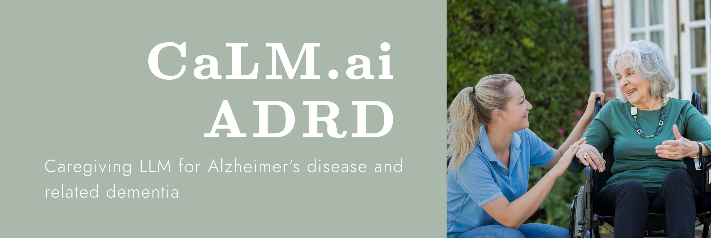

Welcome to the official repository for **CaLM-ADRD** : An intelligent Retrieval-Augmented Large Language Model System designed to assist caregivers of patients with Alzheimer's Disease and Related Dementias (ADRD). This system leverages local LLMs through Ollama and Langchain to provide contextual, accurate, and helpful information for family caregivers.

## Table of Content

1. [Features](#-features)
2. [AI Memory](#ai-memory)
3. [Getting Started](#-getting-started)
4. [Installation](#installation)


## Features

### AI Memory
Memory are categoriezed into two level Long term memory (LTM) and short term memory (STM), Bio, job, social relationship, relationship with care recipient, topics if interest to user etc.,are considered as global level memory which is LTM and stored in the database. Preferences, answer tone, language, etc., are considered as short term memory. They will be stored in runtime variable. Some of them are loaded from disk while others are inferred from rounds of converation.

All memory will be generated and express as a sentences.


From technical perpective, we defined two classes: `MemoryItem` used for classify each item/attribute in user profile and `Memory` the overall user profile

```python
class Memory Item
    id: int # The unique identifier for memory
    content: str # Actual content of this memory attribute
    level: Literal["LTM", "STM"] # To which level of granularity this memory attribute belongs to
    category: str # Category of this memory attribute
    type: str # Attribute name
    source: str # Where this memory comes from
    timestamp: datetime # When this memory is created
    metadata: dict # Additional metadata about the memory item
    
    # Methods
    convert_to_sentence(categories: List[str]) # Converts memory item to a sentence
    convert_to_attributes() # Converts sentence to memory attributes

class Memory
    id: int # Unique identifier
    user_profile: List[MemoryItem] # Collection of memory items for a user
    created_at: datetime # When the memory was created
    updated_at: datetime # When the memory was last updated
```

In example

```python
# user item will be like this:
stm_exp = "This user's PREFERENCE is step-by-step reasoning with references"

ltm_exp =  "[CATEGORY: ALZ INFO] The user's CARE RECIPIENT is DAD

# whole user profile would be a list of LTM sentences, when comes to prompt in each session, it would be combination of LTM and STM.
```

## 🚀 Getting Started

### Installation

1. Clone the repository:

```bash
git clone [repository-url]
cd LangchainRag_Ollama
```

2. Create and activate a virtual environment:

```bash
python -m venv env
source env/bin/activate  # On Windows: env\Scripts\activate
```

3. Install dependencies:

```bash
pip install -r requirements.txt
```

4. Start Ollama service locally

## 🔒 Privacy & Security

- All processing is done locally
- No sensitive data is sent to external services
- Secure storage of medical and personal information

## 🙏 Acknowledgments

- Healthcare professionals and caregivers who provided domain expertise
- Open-source community for tools and libraries
- Research papers and medical resources that form our knowledge base

## 📝 License

This project is licensed under the MIT License - see the LICENSE file for details.